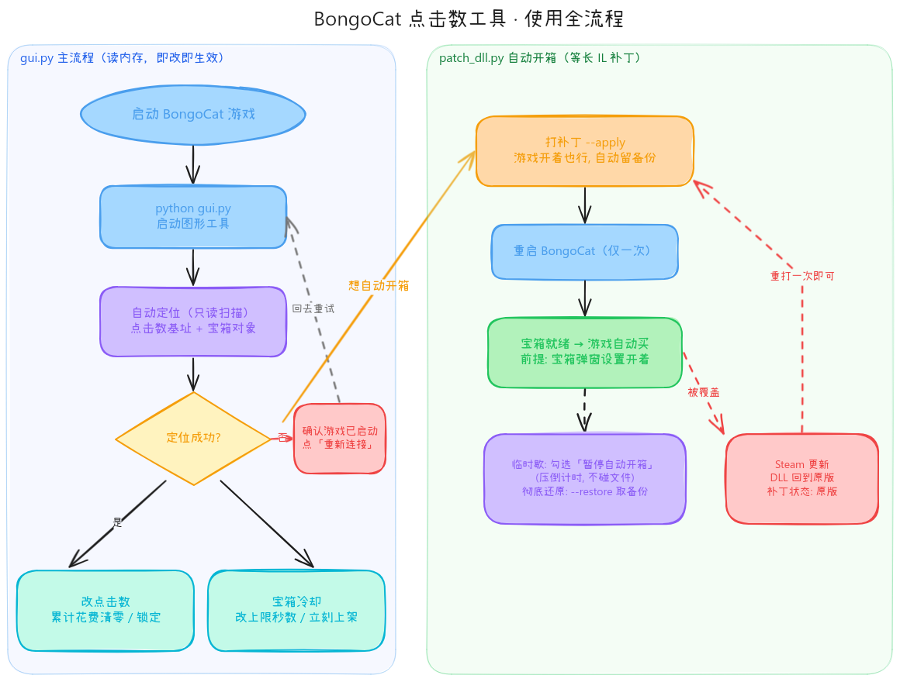

# BongoCat 点击数工具 · 使用说明（源码版）

给 Steam 桌面宠物 [BongoCat](https://store.steampowered.com/app/1737300/BongoCat/) 的单机辅助脚本：修改点击数、加速宝箱冷却、自动开箱。游戏无联网对战与反作弊，数据走 Steam 本地统计，改动安全。

## 环境要求

- Windows + Python ≥ 3.10（tkinter 随安装包自带，无需另装）
- 只有用到 `patch_dll.py`（自动开箱补丁）时多装一个纯 Python 库：

```
pip install dnfile
```

内存读写、界面、补丁全部零其他依赖，克隆即用。

## 使用全流程



左路是 GUI 主流程（读内存即改即生效），右路是一次性的 DLL 补丁生命周期。

## 主程序：`python gui.py`

BongoCat 游戏开着就行。工具启动后自动连接进程并做约 10 秒的只读扫描，定位两类对象，然后三个功能都在「② 操作面板」卡片里：

| 功能 | 操作 | 效果 |
|---|---|---|
| 改点击数 | 「一键清零」/ 输入累计花费 + 「应用」 | 把花掉的点击数拿回来（上限 = 累计获得） |
| 改点击数 | 勾选「锁定累计花费」 | 之后开箱不再扣点，扣除被工具即时拦回 |
| 宝箱冷却 | 「冷却上限(秒)」+「应用」/「立刻上架」 | 30 分钟可缩到几秒；倒计时压到 1 秒 |
| 宝箱冷却 | 勾选「保持随时可开」 | 倒计时一超过设定上限就自动压回去 |
| 自动开箱 | 「打补丁」按钮 | 游戏开着也能直接写（自动备份原 DLL），**重启 BongoCat 一次后生效** |
| 自动开箱 | 勾选「暂停自动开箱」 | 工具按住倒计时不让归零，临时关闭自动买，不碰文件 |
| 自动开箱 | 「还原」按钮 | 用备份恢复原版 DLL |

> 自动开箱的原理：把游戏 `Assembly-CSharp.dll` 里 `Shop.OnChestReady()` 尾部的"显示宝箱图标等你点"（10 月起为 `_shopVisuals.Show()`）等长替换为 `_shopItem.Buy()`，宝箱一就绪游戏自己就买。前提：游戏内「宝箱弹窗」设置保持开启。
> 点数值 60 秒内由游戏的 `StoreStats()` 写回 Steam，重启不丢；界面显示拍一下猫键盘即刷新。

## 命令行用法（不开 GUI）

```
python patch_dll.py --status     看当前 DLL 是原版还是已打补丁、补丁代次
python patch_dll.py --apply      打补丁（游戏运行中也可写，自动备份）
python patch_dll.py --restore    按最近备份还原
python pets_tool.py auto         只读: 按结构自定位点击数, 打印三元组
python pets_tool.py spent <addr> 0   累计花费清零
python pets_tool.py hold  <addr> [v] 持续锁定累计花费 (Ctrl+C 停)
```

## 文件结构

| 文件 | 职责 |
|---|---|
| `gui.py` | 主程序（tkinter 深色界面）：连接 → 定位 → 改数值 / 冷却 / 打补丁 |
| `gamemem.py` | 底层库：ctypes 内存扫描、读写、进程查找（无第三方依赖） |
| `autoclick.py` | DPI 感知点击探测 + `config.json` 读写（开箱计数存这里） |
| `patch_dll.py` | 等长 IL 补丁器：双代模式自适应，匹配不唯一就拒写 |
| `pets_tool.py` | 点击数定位/修改的命令行版（与 GUI 卡片①同源） |
| `assets/` | 图标与本文档流程图 |

> 当前游戏 2026-10 代：`Shop`/`Pets` 字段布局与内存定位逻辑全部通用；补丁点由 `patch_dll.py` 动态解析 token 适配。

## 问题排查

- **数字不刷新 / 显示"—"**：基址失效（多半刚重启过游戏），点「自动定位」重扫。
- **补丁状态显示"原版"、自动开箱突然不干活**：Steam 更新覆盖了 DLL，`--apply` 重打一次即可。
- **`--apply` 报"找不到原版字节"**：游戏代码又改版了，补丁脚本按设计拒绝写入（不会写坏文件），需要重新做一轮 IL 差分维护。
- **提示权限不足**：游戏装在 `Program Files (x86)`，个别环境需要以管理员身份运行终端再执行写补丁命令。

## 开源协议

本项目采用 [GNU General Public License v3.0](LICENSE) 发布。

你可以自由使用、修改、分发本项目的代码；但任何基于本项目的衍生作品**必须同样以 GPL-3.0 开源**，不得闭源发布，也不得作为闭源商业软件分发。完整条款见 [LICENSE](LICENSE)。
